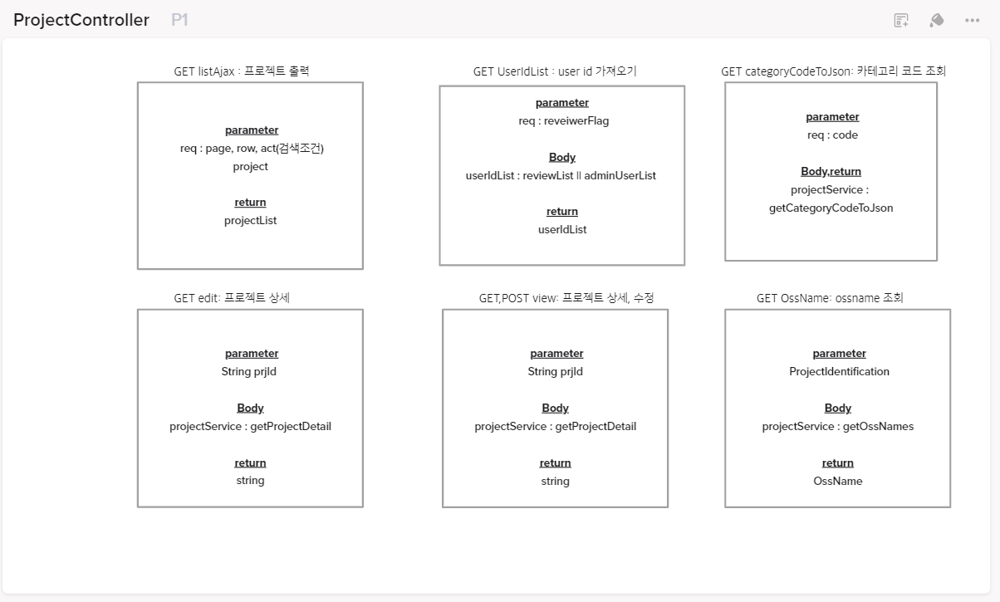

# Fosslight 공부한 기록 정리하는 Repository

# Fosslight 공부

- api
    - api/advice
        
        Exception 정의
        
        - CommunicationException : ?
        - CSigninFailedException : 로그인 실패
        - CUserNotFoundException : 유저가 없을 경우
        - ExceptionAdvice : 로직에서 발생하는 예외들을 통합관리하는 곳, 결과를 클라이언트에게 반환해준다
    - api/aop
        - ApiControllerAspect : log 부가기능
    - api/controller/v1 : *extends CoTopCompent*
        
        //모든 컨트롤러가 CoTopComponent를 상속하고있음
        
        //api컨트롤러가 모여있음
        
        ? : 각 controller의 기능 파악필요
        
    - api/entity
        
        //API response에 포함될 entity 정의
        
        - CommonResult : 부모클래스
        - ListResult : List entity
        - SingleResult : 원소 하나 entity
    - api/service
        - ResponseService : 요청 결과 가공한 service
- common
    
    프로젝트내에서 공통적으로 사용되는 모듈
    
    - AjaxSessionTimeoutFilter : 사용자가 로그인 세션이 만료되었을때 ajax 호출되었을때
    - CustomXssFilter : Cross Site Scripting 처리
    - SearchType : 기능들명 열거 enum (oss, project, license, self_check ..)
    - url : fosslight 페이지들 url 정의
- config
    
    //bean들 환경설정해주는 configuration들 구현되어 있음
    
    - AppConfig : 메일 서비스 bean들 환경설정
    - AppConstBean : config 변수 저장
    - ContainerConfig : jsp custom
    - CustomAuthenticationProvider : 로그인 인증에 필요한 메소드 정의 (근데 왜 config에 있는 지 모르겠음,,,)
    - CustomCacheEventLogger : 케쉬관련 event 발생시 출력되는 log cusotm
    - DatasourceConfig : db 연결 bean 환경설정
    - SecurityConfig : 보안 bean들 설정
    - StaticResourceConfig : 정적파일들 루트 설정
    - SwaggerConfig : Swagger 설정
    - TilesConifg : tiles 설정
    - WebClientConfig : client에서 발생할 수 있는 이벤트(timeout)들 관련한 설정
    - WebConfig :웹 관련된 처리 설정( interceptors, resourcehandler, argumentResolver과 같은)
        - interceptor → 특정 path가 포함되면 intercept하는 내용
        - resourcehandler → resource path, cache period 설정하는 내용
        - argumentresolver → path의 arguement 설정 (default page 얼마로 할 지)
- controller
    - AdviceController : 프로젝트에서 호출되지 않음
- ProjectController
    
    
    
    
    
    

    
- repository
    
    //Entity에 의해 생성된 데이터베이스에 접근하는 메서드를 사용하기 위한 인터페이스
    
    중점적으로 봐야 할 주요 클래스
    
    - BinaryDataHistoryMapper
    - DashboardMapper
    - LicenseMapper
    - FileMapper
    - ProcessGuidMapper
    - ProjectMapper
    - SearchMapper
    - SelfCheckMapper
    - VulnerabilityMapper
    
- scheduler
    
    //프로젝트내에서 호출되지 않음
    
- util
    - CompressUtil :  파일압축기능
    - CryptUtil : 암호 복호화 기능
    - csvUtil : csv 파일 excel로 변경
    - DateUtil : date 관련 기능, 포맷
    - ExcelDownLoadUtil : excel 다운로드 기능
    - ExcelUtil : excel 관련 기능
    - FileUitl : file 관련 기능
    - JwtUtil : jwt 관련 기능
    - OssComponentUtil : OssComponent 관련 기능 //  코드 분석 더 필요함 정확히 어떻게 쓰이는 지 몰라
    - RequestUtil : client에게 오는 request 관련 기능 // 근데 다른 클래스에서 호출하는 곳이 없음
    - SPDXUtil2 : SPDX 파일형식 관련 기능
    - StringUtil : 문자열 관련 검색, 변환, 치환, 유효성 체크등의 기능 제공
    - YamlUtil : Yaml 관련 기능
- domain
    
    // domain들 
    
- service/impl
    
    //
    
    - ApiBatServiceImpl : → binary search에 사용됨
    - ApiCodeServiceImpl : code type 반환 → code search에 사용됨
    - CacheServiceImple : licenese 데이터 중 캐시로 남아야할 데이터들 접근
    - ApiFillOssInfoServiceImpl
    - ProjectServiceImpl
    - SearchServiceImpl
    - SeflCheckServiceImpl
- validation
    
    //접근이나 페이지들 validation에 관련된 코드들
    
    //공부가 더 필요함
    

cotopcomponent : 공통 메소드를 정리한 파일

- 질문
    
    1.spring코드중에 fosslight/src/main/java/oss/fosslight/domain/T2Code에 있는 Code 정확히 어떤 걸 의미하는 건가요?
    
    김소임멘토님 : T2Code는 code management를 구성하기 위한 파일입니다. T2Code와 T2CodeDtl 파일이 같이 묶인 파일이고 T2Code는 main code T2CodeDtl은 sub code입니다.
    
    2. domain에 보면 몇몇 domain들의 이름에 T2가 붙어 있는데 T2는 어떤 경우에 붙는 건가요?
    
    김소임멘토님 :  T2는 의미 없는 키워드입니다. (추후 refactoring시 rename해야겠네요)
    
    3. controller에서 apicontroller와 controller의 차이가 무엇인가요?
    
    김소임멘토님 : swagger-ui.html로 테스트해보실수 있는 기능들을 전부 apiController에서 관리하고 있습니다.
    
- 정리
    
    **AOP**
    
    핵심기능과 부가기능을 독립적인 aspect로 분리하는 설계
    
    이렇게 분리된 aspcet는 필요한 위치에 동적으로 참여할 수 있게 된다.
    
    **AOP 용어**
    
    - 타겟 : 핵심기능에 해당, 부가기능을 부여할 대상이 된다.
        
        
    - 어드바이스 : 타겟에 제공할 부가기능을 담고 있는 모듈
    
    - 조인포인트 : 어드바이스가 적용되는 위치
    
    - 포인트 컷 : ?
    
    - 에스펙트 : AOP의 기본 모듈, 싱글톤 형태로 존재
    
    - 위빙 : 포인트컷에 의해 결정된 타겟의 조인 포인트에 부가기능을 삽입하는 과정
    
    **Ajax**
    
    : 특정 페이지에서 데이터 변화가 존재할때 그 페이지를 리로딩을 하는 것이 아니라 ajax를 이용해 동적으로 데이터만 바꾸어준다
    
    
    
    **XSS**
    
    크로스 사이트 스크립팅(Cross Site Scripting, XSS)은 공격자가 상대방의 브라우저에 스크립트가 실행되도록 해 사용자의 세션을 가로채거나, 웹사이트를 변조하거나, 악의적 콘텐츠를 삽입하거나, 피싱 공격을 진행하는 것을 말합니다.
    
    **bean**
    
    new를 사용해서 사용자가 만들어 관리하는 객체가 아닌 사용자가 정의하면 spring에서 관리하는 객체
    
    **JSP**
    
    html에 java 코드를 넣어 동적웹페이지로 작동하게 하는 도구
    
    **Tiles**
    
    웹페이지의 상단이나 하단에 반복적으로 사용되는 부분들 코드 분리해서 관리해주는 프레임워크
    
    **JWT**
    
    Json 포맷을 이용하여 사용자에 대한 속성을 저장하는 토큰
    
    **AutoCompleteAjax**
    
    입력 필드에 타이핑을 하면 자동으로 남은 검색어를 완성해주는 기능을 jQuery UI 에서 이미 구현을 다 해놨다.
    
    이것을 jQuery UI에서는 autocomplete 라고 부른다.
